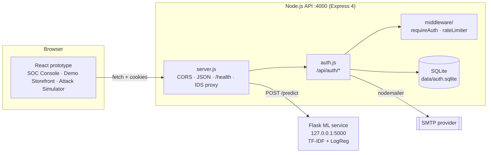

# Architecture

Self-contained technical reference. Verified against source on 2026-09-21. **[ASSUMPTION]** marks inferences; **[MISMATCH]** marks places where code and UI labels disagree.

## 1. System context



Three processes in dev: Node API (4000), Flask ML (5000, loopback only), and the browser. The browser never calls Flask directly.

## 2. Real vs simulated

| Capability | Reality |
|-----------|---------|
| Register, verify email, login, 2FA, refresh, logout, reset, audit log | **Real** (backend) |
| Payload classification (SQLi / XSS / benign, plus a few network phrases) | **Real but toy**: trained at startup on 15 hardcoded strings |
| Network-layer detection (Port Scan, DoS, Brute Force) | **Simulated** in the UI (preset alerts). No packet capture |
| Alerts, blocklist, KPIs, heatmap | **Browser memory only**, seeded with mock data; lost on refresh |
| Model cards: "XGBoost / RandomForest", "CICIDS2017", 94.8% / 97.1% / 96.4% accuracy, "Retrain Model" | **Hardcoded placeholders [MISMATCH]**: real model is TF-IDF + LogisticRegression; no retrain endpoint |
| Admin-only console | **Client-side role check only**; no admin API exists yet |
| SOC Console reachable after real login | **JSX build only.** In the HTML build an admin lands on a placeholder page and the console, Attack Simulator and 403 view are unreachable |
| IDS inspection of login / reviews | **JSX build only.** The HTML build makes no `/api/ids/predict` calls |
| Source IPs in alerts | Hardcoded demo values (e.g. `203.0.113.9`) |

## 3. Components

| Component | Files | Responsibility |
|-----------|-------|---------------|
| App bootstrap | `server.js` | Validates required env, CORS allow-list (`CORS_ORIGINS`; `"null"` origin allowed when not production), JSON body limit 32 kb, `/health`, `POST /api/ids/predict` proxy, mounts `/api/auth`, global error handler |
| Auth router | `auth.js` (~430 lines) | All auth/2FA/session/reset routes, audit helper, token issuing, user serialisation (`publicUser`) |
| Persistence | `db.js` | Opens SQLite (WAL, FK on), creates tables and indexes idempotently |
| Mail | `mailer.js` | SMTP transport per send; templates: verification, OTP, password-reset link (unused), security alert |
| Middleware | `middleware/auth.js`, `middleware/rateLimiter.js` | Bearer-JWT guard that re-reads the user; four rate limiters |
| Utilities | `utils/tokens.js`, `utils/totp.js` | Random tokens, 6-digit OTP, SHA-256; TOTP secret/verify/QR |
| CLI | `scripts/create-admin.js` | Creates a verified admin |
| ML service | `ml_service/app.py` | Trains model on import; `GET /health`, `POST /predict` |
| Frontend (two diverging builds, see 3.1) | `files/idps_frontend_prototype.jsx` (IDS + SOC Console), `files/idps_prototype.html` (newest; real-auth overlay, no IDS) | All UI, mock data, backend calls |

### 3.1 Frontend builds (two, diverging)

| Build | File (mtime) | What it contains | Backend calls |
|-------|--------------|------------------|---------------|
| **JSX** | `files/idps_frontend_prototype.jsx` (26 Aug, 1,144 lines) | SOC Console (mock data), Demo Storefront, Attack Simulator, 403 overlay, admin login | register, login, forgot-password (request only), 2fa/verify, ids/predict |
| **HTML** (newest) | `files/idps_prototype.html` (27 Aug) | `<script>` 1: older compiled React prototype (mock logins, SOC Console, Simulator). `<script>` 2 (~190 lines): hand-written vanilla-JS **overlay** | register, login, 2fa/verify, forgot-password, reset-password/verify-otp, reset-password, logout |
| Stale archives | `files.zip` (25 Aug), `files/idps_prototype.zip` (22 Aug) | Mock-only UI snapshots | none |

**How the HTML overlay works:** a `MutationObserver` on `#root` re-applies patches whenever React re-renders. It finds the "Sign In" button by its visible text, intercepts its click in the capture phase (`stopImmediatePropagation`, so the mock login never runs), and injects panels for create-account, OTP entry and the 3-step forgot-password flow. After a successful `/2fa/verify` it **replaces `#root` with `innerHTML`** (unmounting React) and shows a *user home* (product search, reviews list, logout) or, for `role: "admin"`, a *placeholder admin home* ("Security Operations Center - Authentication complete"). It escapes the user name (`safeName`), adds comments via text nodes, hides the demo-credential and attack hints, and renames the banner to "Aegis Security Platform".

Consequence: **neither build has every feature** (see the "Real vs simulated" table and `memory.md` I-09, I-18). Consolidation into one React app is Phase 5, step 1.

## 4. Key flows

### 4.1 Registration and verification
`POST /register` -> validate (Gmail-only, strong password) -> insert user (`email_verified=0`, bcrypt cost 12, verify token 30 min) -> send email -> on mail failure **delete the user** and return 503 -> `GET /verify-email?token=` sets `email_verified=1` and returns a small HTML page.

### 4.2 Login with mandatory 2FA
```mermaid
sequenceDiagram
  participant B as Browser
  participant A as Node API
  participant D as SQLite
  participant M as SMTP
  B->>A: POST /login {email, password}
  A->>D: load user; check disabled / lockout
  A->>A: bcrypt.compare
  alt wrong password
    A->>D: attempts++ (lock 15 min at 5)
    A-->>B: 401 / 423 (+ alert email on lock)
  else correct and verified
    A->>A: pendingToken = JWT{purpose:2fa} 10 min (PENDING_2FA_SECRET)
    opt method = email
      A->>D: insert otp (sha256, 5 min)
      A->>M: send 6-digit code
    end
    A-->>B: {requires2FA, method, pendingToken}
  end
  B->>A: POST /2fa/verify {pendingToken, code}
  A->>D: check TOTP or latest unconsumed OTP (max 5 attempts)
  A->>D: store sha256(refreshToken)
  A-->>B: {accessToken (15m), user} + httpOnly refresh cookie (7d)
```
The password is checked **before** the "email not verified" check.

### 4.3 Sessions
- Access token: JWT `{sub, role}`, 15 min, `Authorization: Bearer`. `requireAuth` re-loads the user each request, so `account_disabled` applies immediately.
- Refresh token: 48 random bytes; only SHA-256 stored; cookie `httpOnly`, `sameSite=lax`, `path=/api/auth`, `secure` in production; **rotated** on each `/refresh`; all revoked on password reset.

### 4.4 Password reset (current = OTP-based)
`POST /forgot-password` (generic reply, emails 6-digit OTP, 10 min) -> `POST /reset-password/verify-otp` returns `resetToken` (10 min) -> `POST /reset-password` sets the password, revokes all sessions, emails an alert. A leftover link-style page `GET /reset-password?token=` also exists. **The HTML build implements all three steps (email -> OTP -> new password); the JSX build only performs step 1.**

### 4.5 Payload inspection (IDS path)
Storefront login form or review box -> `classifyPayloadWithMl(text)` -> `POST /api/ids/predict` -> Node proxies to Flask -> `{malicious, type, confidence, severity, model}`.
- Malicious: push alert to client state, add IP to client blocklist, show full-screen 403 view.
- Benign: continue (real login call, or post the comment).
- ML unreachable: regex fallback for SQLi/XSS.

## 5. Data model (SQLite, `data/auth.sqlite`)

IDs are UUID v4 strings; timestamps are epoch **milliseconds**; booleans are 0/1. No migrations: tables are created with `CREATE TABLE IF NOT EXISTS`.

| Table | Columns (key ones) | Notes |
|-------|-------------------|-------|
| `users` | `id`, `name`, `email` (UNIQUE, lowercased), `password_hash`, `role` (`user`\|`admin`), `email_verified`, `email_verify_token/_expires`, `two_fa_enabled` (always 1), `two_fa_method` (`email`\|`totp`), `totp_secret`, `password_reset_token/_expires`, `failed_login_attempts`, `lockout_until`, `account_disabled`, `created_at`, `updated_at` | Verify/reset tokens and TOTP secret stored unhashed |
| `refresh_tokens` | `id`, `user_id` (FK, cascade), `token_hash` (UNIQUE), `expires_at`, `revoked`, `created_at` | Index `(user_id, revoked)`; never purged |
| `otp_codes` | `id`, `user_id` (FK, cascade), `code_hash`, `purpose` (`login_2fa`\|`password_reset`), `expires_at`, `attempts`, `consumed`, `created_at` | Index `(user_id, purpose, consumed, created_at)`; never purged |
| `audit_log` | `id`, `user_id`, `email`, `event`, `ip`, `detail`, `created_at` | No FK; write-only today |

Audit events: `register`, `verify_email`, `resend_verification`, `login_failed`, `login_blocked_disabled`, `login_blocked_lockout`, `login_blocked_unverified`, `2fa_challenge_totp`, `2fa_sent_email`, `2fa_failed`, `2fa_success`, `login_success`, `2fa_resend`, `forgot_password_requested`, `password_reset`, `2fa_totp_enabled`, `2fa_method_email`.

**Missing (needed next):** `alerts`, `blocked_ips` tables.

## 6. HTTP API summary

Errors are `{ "error": "..." }`; successes often `{ "message": "..." }`. Limiters: **login** 10/15 min, **otp** 10/10 min, **forgot** 5/15 min, **register** 5/hour (per IP).

| Endpoint | Auth | Limiter | Purpose |
|----------|------|---------|---------|
| `GET /health` | none | none | liveness |
| `POST /api/ids/predict` | none | **none** | `{payload}` -> ML verdict; 400 blank, 503 ML down |
| `POST /api/auth/register` | none | register | create account, send verification |
| `GET /api/auth/verify-email?token=` | none | none | verify (HTML page) |
| `POST /api/auth/resend-verification` | none | register | new verification email (generic reply) |
| `POST /api/auth/login` | none | login | step 1 -> `{requires2FA, method, pendingToken}`; 401/403/423 |
| `POST /api/auth/2fa/verify` | pendingToken | otp | step 2 -> `{accessToken, user}` + cookie |
| `POST /api/auth/2fa/resend` | pendingToken | otp | resend email OTP |
| `POST /api/auth/refresh` | cookie | none | rotate refresh, new access token |
| `POST /api/auth/logout` | cookie | none | revoke + clear cookie |
| `POST /api/auth/forgot-password` | none | forgot | send reset OTP (generic reply) |
| `POST /api/auth/reset-password/verify-otp` | none | forgot | OTP -> `resetToken` |
| `GET /api/auth/reset-password?token=` | none | none | leftover HTML form |
| `POST /api/auth/reset-password` | resetToken | forgot | set new password (>= 8 chars only) |
| `POST /api/auth/2fa/totp/setup` | Bearer | none | new TOTP secret + QR data URL |
| `POST /api/auth/2fa/totp/confirm` | Bearer | none | activate TOTP |
| `POST /api/auth/2fa/method/email` | Bearer | none | switch back to email OTP |
| ML: `GET /health`, `POST /predict` | internal | none | `{payload}` -> `{malicious, type, confidence, severity, model}` |

`user` shape returned to clients: `{ id, name, email, role, twoFaMethod, emailVerified }`.

**Endpoints the UIs actually call**
- JSX build: `register`, `login`, `forgot-password`, `2fa/verify`, `ids/predict`.
- HTML build: `register`, `login`, `2fa/verify`, `forgot-password`, `reset-password/verify-otp`, `reset-password`, `logout`.
- Called by neither: `resend-verification`, `2fa/resend`, `refresh`, all TOTP/2FA-method management.

## 7. ML service

- `Pipeline(TfidfVectorizer(ngram_range=(1,2), sublinear_tf=True), LogisticRegression(max_iter=1000, random_state=42))`, trained on 15 `(text, label)` pairs at process start (no saved model, no evaluation).
- Classes: Benign, SQL Injection, XSS, Port Scan, DoS Flood, Brute Force. Severity map: SQL Injection = Critical, DoS Flood = Critical, Port Scan = High, Brute Force = High, XSS = Medium, Benign = Low.
- `confidence` = max class probability rounded to 4 dp. `malicious` = class != Benign.

## 8. Configuration (names only, never values)

`PORT`, `NODE_ENV`, `APP_BASE_URL`, `CORS_ORIGINS`, `FRONTEND_URL` (optional; falls back to a hardcoded Windows `file:///D:/...` path), `JWT_ACCESS_SECRET` (required), `PENDING_2FA_SECRET` (required), `ACCESS_TOKEN_TTL`, `REFRESH_TOKEN_TTL`, `TOTP_ISSUER`, `ML_SERVICE_URL`, `SMTP_HOST`, `SMTP_PORT`, `SMTP_SECURE`, `SMTP_USER`, `SMTP_PASS`, `MAIL_FROM`.

## 9. Security architecture

- bcrypt cost 12; register policy = 8+ chars with upper/lower/digit/special (reset only checks length).
- OTP and refresh tokens hashed (SHA-256); verify/reset tokens and TOTP secret stored plain.
- Two JWT secrets (access vs pending-2FA); lockout 5 fails / 15 min; per-IP rate limits (in-memory store).
- CORS allow-list with credentials; `x-powered-by` off; `trust proxy` = 1.
- Enumeration hygiene: generic replies on forgot/resend; `register` reveals duplicates (409).

## 10. Deployment and runtime

No Docker/CI/hosting config. **[ASSUMPTION]** Local Windows demo. Commands: `npm run dev` (API), `npm run ml` (Flask), `npm run create-admin -- "Name" email password`. Requires Node >= 22.5 (`node:sqlite`).

## 11. Extension points (where new work plugs in)

| Need | Plug in at |
|------|------------|
| New protected API | new router file mounted in `server.js`; use `requireAuth` + new `middleware/requireRole.js` |
| Persist alerts | new tables in `db.js`; write to them from the `/api/ids/predict` handler; add `GET /api/alerts` (admin) |
| Better model | `ml_service/app.py` (load a saved model; keep the response contract) |
| Network layer | separate detector service/model feeding the same alert store |
| UI session handling | in the consolidated frontend: keep the access token in memory, call `/refresh` on load (neither build does), keep Logout (HTML overlay has it) |
